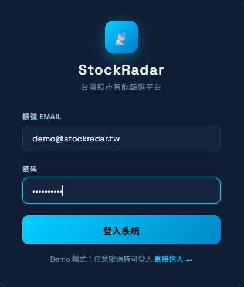
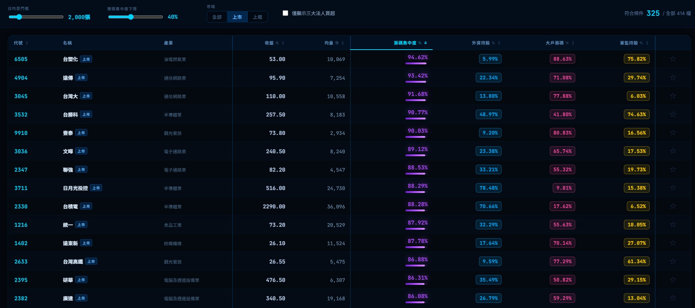

# StockRadar — Taiwan Stock Screener

A self-hosted stock screener for the Taiwan market (TWSE + TPEX).
It pulls quote, institutional-flow and shareholder-concentration data from public sources on a schedule, lets you filter 1,900+ stocks with adjustable sliders, and emails a weekly digest.

> Running in production on an Oracle Cloud Ampere A1 VM (2 OCPU / 12 GB, ARM), behind Caddy with a Let's Encrypt certificate.
> Accounts are invite-only: anyone can apply, but an admin has to approve the account before it can log in.

[](https://www.python.org/)
[](https://fastapi.tiangolo.com/)
[](https://react.dev/)
[](https://www.typescriptlang.org/)
[](https://www.postgresql.org/)
[](https://docs.docker.com/compose/)

---

## Screenshots



> Login and account application. Registering creates a pending account — it can't log in until an admin approves it.



> Filter bar: drag the sliders to adjust volume and concentration thresholds. Results update without a page reload.
> Showing 325 out of 414 stocks, sorted by concentration.

---

## Why I built this

Checking shareholder concentration for Taiwan stocks by hand means visiting TWSE, TPEX and TDCC separately — three different interfaces, no way to combine them. Screening even 50 stocks took over an hour.

I wanted one tool that pulls all the sources automatically, scores every listed and OTC stock, and lets me move a slider instead of maintaining a spreadsheet.

---

## What's in it

- **Full stack**: FastAPI (Python 3.11) + PostgreSQL 16 + React + TypeScript, served behind Caddy
- **Concurrent scraping**: the scrapers run in parallel with `asyncio.gather` — TWSE quotes, TPEX quotes, TDCC shareholder distribution, ownership ratios — covering 1,900+ stocks
- **Two schedules**: a light weekday run at 18:00 (quotes + institutional flow), and a full run on weekends that also refreshes TDCC concentration data and sends the digest
- **Account approval**: registration creates a pending account and notifies the admin. Every data endpoint requires a valid login, and account status is re-checked on each request, so disabling someone takes effect immediately instead of when their token expires
- **Alembic migrations**: schema changes are versioned; `deploy.sh` runs `alembic upgrade head` before the API starts
- **Tests against a real database**: each test runs inside a transaction that gets rolled back, so tests can call `commit()` normally without leaking into one another. CI spins up a PostgreSQL service and verifies the migrated schema matches the models before running pytest
- **Daily backups**: `pg_dump` on a cron schedule, with a restore drill script to prove the dumps actually restore
- **CSV export**: downloads the filtered result as UTF-8 BOM CSV, so Excel opens it without re-encoding

---

## Architecture

```
┌─────────────────────────────────────────────────────────┐
│  Browser                                                │
│  React 18 + TypeScript · TanStack Query · Zustand       │
│  Recharts · Axios · Vite                                │
└──────────────────────┬──────────────────────────────────┘
                       │  HTTPS  (Caddy — auto TLS)
┌──────────────────────▼──────────────────────────────────┐
│  FastAPI  (Python 3.11 + uvicorn)                       │
│  ├─ POST /api/auth/register  apply for an account       │
│  ├─ POST /api/auth/login     returns JWT if approved    │
│  ├─ GET  /api/screen         filter stocks              │
│  ├─ GET  /api/stocks/{code}  stock detail               │
│  ├─ *    /api/watchlist      personal watchlist CRUD    │
│  └─ *    /api/admin/users    approve / reject / disable │
│      every route above requires a logged-in,            │
│      active account; admin routes also require role     │
└──────────────────────┬──────────────────────────────────┘
                       │  asyncpg / SQLAlchemy (async)
┌──────────────────────▼──────────────────────────────────┐
│  PostgreSQL 16   (Docker volume, schema via Alembic)    │
└─────────────────────────────────────────────────────────┘

  Scheduler service  (its own container, cron on Asia/Taipei)
  ┌─────────────────────────────────────────────────┐
  │  Mon–Fri 18:00  quotes + institutional flow     │
  │  Sat 10:00      full pipeline + email digest    │
  │  Sun 10:00      full pipeline (no email)        │
  │                                                 │
  │  twse_scraper.py      TWSE quotes + T86 flow    │
  │  tpex_scraper.py      TPEX quotes + flow        │
  │  tdcc_scraper.py      shareholder distribution  │
  │  ownership_scraper.py institutional ownership   │
  │          └── data_pipeline.py → PostgreSQL      │
  └─────────────────────────────────────────────────┘
```

---

## Key design decisions

**Why store daily quotes instead of fetching live?**
A 20-day average volume needs 20 rows of history, and neither exchange serves moving averages. So we accumulate rows and compute the average in SQL. It also means the app still works when an exchange's API is having a bad day.

**Why not use TWSE's OpenAPI for daily quotes?**
`openapi.twse.com.tw/v1/exchangeReport/STOCK_DAY_ALL` only ever contains the *previous* trading day. That isn't a delay you can wait out — we checked at 18:00, again at 23:00, and again after midnight, and it never advanced. Listed-stock closing prices were silently a day behind OTC ones for as long as we used it. The official site's `www.twse.com.tw/rwd/zh/afterTrading/MI_INDEX` has same-day data right after the close, and it's the same family of endpoints the institutional-flow scraper already used.

**Why look backwards for a trading day?**
`MI_INDEX` answers "what happened on this specific date", so it returns nothing on a weekend. The weekend pipeline still needs the last trading day's quotes, so the scraper walks back day by day until it finds data. The trade date always comes from the response itself, never from `date.today()` — otherwise a Saturday run would write Saturday rows into a table that should only contain trading days.

**Why separate `name` and `short_name`?**
A company's registered name ("台灣積體電路製造股份有限公司") and its display name ("台積電") are different things. Mixing them breaks both the table layout and keyword search.

**Why is there no API to make someone an admin?**
Promotion only happens through `scripts/make_admin.py`, which needs shell access to the server. If there's no endpoint, there's no endpoint to get wrong.

**Why a separate scheduler container?**
The cron jobs stay isolated from the API process. Either can restart without taking the other down, and a scraper crash doesn't affect people browsing the site.

---

## Things that went wrong along the way

| Problem | What we did |
|---------|-------------|
| TWSE OpenAPI silently served yesterday's closing prices | Switched to the official site's `MI_INDEX` endpoint, which has same-day data |
| Cloudflare blocking TDCC requests | Realistic browser headers plus a 1.5 s delay between calls |
| Some TPEX responses are Big5 | Decode explicitly with `response.content.decode("big5")` instead of guessing |
| TDCC's CSRF token expires every session | Fetch the form page first, pull the token out, then request the data |
| TPEX blocked its main OpenAPI mid-project | Moved to ISIN-based queries on an endpoint that still worked |
| Weekend runs wrote weekend-dated rows | Trade date now always comes from the API response; if it can't be parsed, the pipeline fails instead of guessing |
| Production DB predated Alembic | `alembic stamp <baseline>` to record the existing schema, then `upgrade head` for the genuinely new migrations |

---

## Quick start (local)

**Requirements**: Docker Desktop (Compose v2 included)

```bash
# 1. Clone
git clone https://github.com/Yen60229/Taiwan_StockRadar.git
cd Taiwan_StockRadar

# 2. Environment file
cp .env.example .env
# Set DB_PASSWORD and SECRET_KEY at minimum.
# SECRET_KEY: openssl rand -base64 48  — the API refuses to start on a placeholder value.

# 3. Start everything (the API runs `alembic upgrade head` before uvicorn)
docker compose up -d

# 4. Backfill history so the 20-day average is meaningful (first run only, ~20 min)
docker compose exec api python scripts/backfill_history.py

# 5. Open http://localhost:3000
```

Then create your account and approve it:

```bash
# Register through the web UI first, then promote that account
docker compose exec api python -m scripts.make_admin you@example.com
```

`make_admin` also sets the account to active, so the first admin doesn't need anyone to approve them. After that, new applicants show up under **帳號管理** in the UI.

---

## Production deploy

Full walkthrough: [docs/deploy-to-vps.md](docs/deploy-to-vps.md)
Oracle Cloud specifics (free-tier ARM instance, security lists, the retry script for capacity errors): [docs/oracle-cloud-automation.md](docs/oracle-cloud-automation.md)

Short version:

```bash
git clone https://github.com/Yen60229/Taiwan_StockRadar.git /opt/stockradar
cd /opt/stockradar
cp .env.example .env
# Set DOMAIN, DB_PASSWORD, SECRET_KEY, TLS_EMAIL
bash scripts/deploy.sh
```

`deploy.sh` builds the images, starts PostgreSQL on its own, waits for it to be healthy, runs the migrations, and only then brings up the rest. Caddy requests the certificate on first start, so the site is live shortly after DNS points at the machine.

Backups and the restore drill: [docs/backup-restore.md](docs/backup-restore.md)

---

## Environment variables

| Variable | Required | What it's for |
|----------|----------|---------------|
| `DB_PASSWORD` | Yes | PostgreSQL password |
| `SECRET_KEY` | Yes | JWT signing key (`openssl rand -base64 48`). Placeholder values are rejected at startup |
| `DOMAIN` | Production | Your domain — Caddy uses it to request the certificate |
| `TLS_EMAIL` | Production | Address Let's Encrypt sends expiry notices to |
| `RESEND_API_KEY` | Optional | Email delivery via [resend.com](https://resend.com) |
| `SMTP_USER` / `SMTP_PASS` | Optional | Email delivery via Gmail SMTP (use an app password), the fallback when Resend isn't set |
| `EMAIL_FROM` | Optional | Sender address |
| `EMAIL_ADMIN` | Optional | Where error notifications go |

Account notification emails (a new application arrived, your account was approved) need either `RESEND_API_KEY` or the SMTP pair. With neither set, the app logs a warning and carries on — sending mail never blocks approving an account.

---

## Project structure

```
Taiwan_StockRadar/
├── backend/
│   ├── api/              # FastAPI routes: auth / screen / stocks / watchlist / admin
│   ├── models/           # SQLAlchemy models
│   ├── migrations/       # Alembic versions
│   ├── scraper/          # TWSE / TPEX / TDCC / ownership scrapers
│   ├── pipeline/         # aggregation pipeline
│   ├── notifier/         # weekly digest + account notification emails
│   ├── scripts/          # cron entry, manual runs, backfills, make_admin
│   ├── tests/            # pytest, including tests against a real PostgreSQL
│   ├── Dockerfile
│   └── requirements.txt
├── frontend/
│   ├── src/
│   │   ├── api/          # Axios client + TypeScript types
│   │   ├── components/   # InstFlowChart …
│   │   ├── pages/        # Dashboard / Stock / Login / Admin
│   │   └── store/        # Zustand auth store
│   ├── Dockerfile
│   └── package.json
├── docs/
│   ├── deploy-to-vps.md
│   ├── backup-restore.md
│   ├── oracle-cloud-automation.md
│   └── roadmap/          # long-range plan and reviews
├── scripts/              # deploy.sh, backup_db.sh, restore_drill.sh
├── docker-compose.yml          # local development
├── docker-compose.prod.yml     # production (Caddy + HTTPS)
├── Caddyfile
└── .env.example
```

---

## Data sources

All public — no paid API needed.

| Source | What it gives us |
|--------|------------------|
| [TWSE 每日收盤行情 (`MI_INDEX`)](https://www.twse.com.tw/) | Same-day quotes for listed stocks (上市) |
| [TWSE 三大法人買賣超 (`T86`)](https://www.twse.com.tw/) | Daily institutional net buy/sell, listed |
| [TPEX OpenAPI](https://www.tpex.org.tw/openapi/) | Quotes and institutional flow for OTC stocks (上櫃) |
| [TDCC](https://www.tdcc.com.tw/) | Shareholder distribution by holding tier — the concentration signal |
| [HiStock](https://histock.tw/) | Foreign and director ownership ratios |

`openapi.twse.com.tw` is deliberately not used for quotes; see the design-decisions section.

---

## Roadmap

> Longer-range plan (backend / frontend / cloud tracks, plus the decision log):
> [docs/roadmap/README.md](docs/roadmap/README.md)

### Done

- [x] TWSE + TPEX quotes, institutional flow, TDCC concentration, ownership ratios
- [x] FastAPI + PostgreSQL backend, React dashboard with live filter sliders, resizable columns, watchlist, CSV export
- [x] Docker Compose deploy for both dev and production
- [x] Live on Oracle Cloud Ampere with Caddy auto-HTTPS
- [x] Weekly email digest
- [x] Alembic migrations and a test suite that runs against a real PostgreSQL in CI
- [x] Daily backups with a verified restore drill
- [x] Account approval workflow, admin panel, login required on every data endpoint
- [x] Institutional flow bar chart on the stock page — view 外資 / 投信 / 自營 / total separately or side by side

### Next

- [ ] Admin two-factor authentication (TOTP)
- [ ] Rate limiting on the auth endpoints
- [ ] Foreign / trust net buy-sell columns on the dashboard table
- [ ] Candlestick chart with concentration trend over time
- [ ] Margin-balance sub-chart
- [ ] Push alerts (LINE / Telegram)

---

## License

MIT © 2026 [Yen60229](https://github.com/Yen60229)
