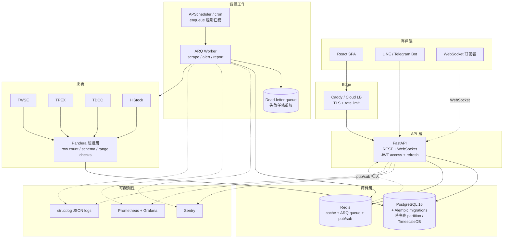

# 後端與資料工程路線圖 (Backend & Data Engineering Roadmap)

> ⚠️ **閱讀前必看**:本文件是「後端單軌視角」,工時假設(每週 8-12h)為單軌獨立估計;實際上三軌(後端/前端/雲端)共用同一個時間池,執行時以 [`README.md`](./README.md) 的**整合時間表**與**跨軌決議(ADR)**為準。本文件中受 ADR 修訂的項目:
> - Phase 1 Week 1-2 的 P0 修復實際工時約 20-25h,應排 3-4 週(ADR-11)
> - Phase 3 的 ARQ 遷移與 Phase 4 的 WebSocket:受終態架構決議影響,已降級/移至 icebox(**ADR-1**)
> - Phase 3 自架 Prometheus + Grafana:改用 Grafana Cloud,只保留 /metrics 輸出(**ADR-3**)
> - pg_dump 備份的唯一 owner 是雲端軌(**ADR-4**),本文件 Phase 3 對應項目為「依賴」而非重複實作
> - /api/screen 分頁設計:依產品決策改為「全量回傳 + 上限保護」(**ADR-5**)
> - Phase 2 需補上 email 驗證、忘記密碼、刪除帳號(**補強-3**),優先於 refresh rotation 細節
> - Phase 4 三大功能改為「三選一序列」,LINE 推播需先做費用試算(**ADR-12、補強-6**)

> 前提:solo 開發者、每週約 8-12 小時。每個 Phase 的任務按優先序排列,做不完就往後推,不要跳過 Phase 1 的安全與測試基礎。

## 目標架構 (Phase 3-4 完成後)

---

## Phase 1(0-3 月):止血 — 安全修復、測試地基、Migrations

### 目標
修掉會造成資料損毀與帳號被盜的 bug,建立「改程式碼不心虛」的測試與 migration 基礎。**這一階段不加任何新功能。**

### 具體任務

**Week 1-2:P0 安全與正確性修復(約 10 小時)**
- [ ] `backend/api/deps.py:79`:`UUID(user_id)` 補 `except (JWTError, ValueError)`,消除偽造 token 造成的 500
- [ ] `deps.py:22`:`SECRET_KEY` 無環境變數時直接 `raise RuntimeError` 拒絕啟動(prod 與 dev 皆然),移除 `docker-compose.yml` 的 `change-me-in-production` fallback
- [ ] `python-jose` → `PyJWT`(CVE-2024-33663/33664),同步清掉 requirements.txt 死依賴:passlib、psycopg2-binary、python-multipart
- [ ] `auth.py` / `watchlist.py` check-then-insert race:改為 insert + `except IntegrityError` 回 409
- [ ] bcrypt 阻塞 event loop:`await asyncio.to_thread(bcrypt.checkpw, ...)` 包裝 `hash_password`/`verify_password`
- [ ] **cron 環境變數 bug(排程實際上每次都失敗的根因)**:`cron_entry.sh` 開頭加 `printenv | grep -E 'DATABASE_URL|RESEND|SMTP|EMAIL' > /etc/environment`,並移除重複的 `crontab` 安裝
- [ ] **週末日期污染 bug**:`run_scheduled.sh` 判斷非交易日改呼叫 `run_offline_pipeline`;或在 `twse_scraper.py:115` / `tpex_scraper.py:114` 改以 API payload 內的交易日期取代 `date.today()`

**Week 3-6:pytest 測試地基(約 20 小時)**
- [ ] 建 `backend/tests/`,加 `pytest`, `pytest-asyncio`, `pytest-cov`, `httpx`, `testcontainers[postgres]` 到 dev requirements
- [ ] `conftest.py`:以 testcontainers 起 PostgreSQL 16、async session fixture、`httpx.AsyncClient(app=...)` fixture
- [ ] 第一批測試(順序即優先序):auth(register/login/錯誤密碼/重複 email/壞 token)→ screen(篩選邊界、排序)→ watchlist(IDOR、重複加入)
- [ ] **爬蟲 parser 快照測試**:存 TDCC HTML、T86 JSON、ISIN HTML、TPEX 3insti JSON 到 `tests/fixtures/`,對 `parse_holding_table`、ISIN parser、T86 欄位索引寫回歸測試 — 這些格式已多次變動,是最高價值的測試
- [ ] GitHub Actions:`.github/workflows/ci.yml` — push/PR 跑 `pytest --cov`(門檻先設 50%)+ `docker build` 檢查

**Week 7-10:Alembic migrations(約 12 小時)**
- [ ] `alembic init backend/migrations`,`env.py` 接 async engine,`alembic revision --autogenerate` 產出 baseline
- [ ] 第二個 migration:補上所有 ForeignKey(`daily_quotes.stock_code → stocks.code`、`watchlist.user_id → users.id ON DELETE CASCADE` 等),先清孤兒資料
- [ ] prod 啟動流程改為 `alembic upgrade head`(在 API container entrypoint 或 deploy.sh),移除對 `init_db()`/create_all 的依賴;`init_data.py` 同步改用 alembic
- [ ] `datetime.utcnow` → `server_default=func.now()`(timezone-aware)

**Week 11-12:pipeline 收尾**
- [ ] `run_scheduled.sh` 正確傳遞 exit code;pipeline 失敗 3 次後寄 admin 告警信(`EMAIL_ADMIN`,TASK.md 規格補實作)
- [ ] `data_pipeline.py` 五個 upsert 函式改為 batched `executemany`(照抄 `backfill_history.py` 的模式)
- [ ] `twse_scraper.fetch_json` 的 bare `except: return []` 補 logging;三份手刻 retry 統一改用 `tenacity`(已在 requirements)

### 學習重點/資源
- **pytest + async 測試**:pytest-asyncio 官方文件、FastAPI Testing 章節、testcontainers-python README
- **Alembic**:官方 tutorial(重點:autogenerate 的限制、async env.py 設定)
- **JWT 安全**:PyJWT docs;閱讀 OWASP JWT Cheat Sheet
- 書:《Architecture Patterns with Python》(cosmicpython)ch.1-6 — 理解 repository/service layer,為 Phase 2 重構鋪路

### 驗收標準
- CI 綠燈:每次 push 自動跑測試,coverage ≥ 50%,auth/screen/watchlist/parsers 皆有測試
- `alembic upgrade head` 可在乾淨的 PostgreSQL 上從零建出完整 schema;FK 約束存在(`\d watchlist` 可見)
- 偽造/壞 token 一律回 401,不再有 500;`SECRET_KEY` 未設定時服務拒絕啟動
- 連續兩個週末排程成功寫入資料且 `daily_quotes` 無週六/週日日期的假資料;pipeline 失敗會收到 email

---

## Phase 2(3-6 月):API 強化與爬蟲可靠性

### 目標
API 達到「可以給陌生人用」的水準(分頁、限流、一致的錯誤格式);爬蟲從「能跑」升級到「壞了會知道、資料進庫前有驗證」。

### 具體任務

**API 強化(約 5 週)**
- [ ] **分頁**:`/api/screen` 加 `limit`(預設 50、上限 200)+ `offset`,回應含 `total`;`fastapi-pagination` 或手寫皆可。前端同步改(配合 frontend roadmap)
- [ ] **Rate limiting**:`slowapi` + Redis backend — `/api/auth/login` 5 次/分鐘/IP、全域 100 次/分鐘;login 失敗對不存在的 email 做 dummy bcrypt verify 消除 timing enumeration;register 的 409 訊息改為中性措辭
- [ ] **Redis 快取**:docker-compose 加 `redis:7-alpine`;screen 結果按 filter 參數 hash 快取(TTL 到下次 pipeline 執行,pipeline 成功後主動 invalidate)— 資料一週才更新一次,cache hit rate 會接近 100%
- [ ] **全域 exception handler**:統一錯誤 schema `{"error": {"code", "message"}}`,處理 `IntegrityError`/`ValidationError`/未預期例外(500 不洩 stack trace)
- [ ] **JWT refresh token**:access token 縮到 30 分鐘,refresh token 7 天存 DB(可撤銷),`POST /api/auth/refresh` + `POST /api/auth/logout`;refresh token 改走 httpOnly cookie
- [ ] **OpenAPI 整理**:修正 `OAuth2PasswordBearer` tokenUrl 422 問題(login 增加 form-data 相容或改用 HTTPBearer);所有 route 補 `response_model`、`summary`、tags;`/api/v1` 版本前綴;`stock_code` 加 `pattern=r"^\d{4,6}$"`
- [ ] 補 `GET /api/health`(檢查 DB + Redis 連線),修正 deploy.sh 與兩份部署文件的 URL

**爬蟲可靠性(約 5 週)**
- [ ] **資料驗證層**:新增 `backend/pipeline/validation.py`,用 `pandera` 定義每個來源的 DataFrameSchema — 欄位型別、`close > 0`、`volume >= 0`、`0 <= conc_ratio <= 100`、**row count 下限**(TWSE < 800 檔或 TPEX < 500 檔即 fail);驗證失敗 = pipeline fail = 告警信,絕不寫入半套資料
- [ ] **交易日期驗證**:比對 API payload 的日期欄位與預期交易日,不符即 abort(徹底根治 Phase 1 的日期 bug)
- [ ] `_roc_to_date()` 解析失敗改 raise 而非回傳 `date.today()`
- [ ] **pipeline_runs 稽核表**:`(id, run_type, started_at, finished_at, status, rows_by_table jsonb, error)`,每次執行寫入;email 報告附上本次 run 統計
- [ ] **Dead-letter 處理**:TDCC/HiStock 單檔失敗不中斷整批 — 失敗 stock_code 記入 `scrape_failures` 表,run 結束後對失敗清單重試一輪,仍失敗列入告警信
- [ ] **移除 40% 門檻的 scrape-time 過濾**:`chip_concentration` 存全部候選股的完整序列,篩選移到 query time — 這是未來趨勢分析與回測的資料基礎,越早開始累積越好
- [ ] HiStock 補上 `REQ_DELAY` 實際 sleep;閾值設定統一:`backend/config.py`(pydantic-settings)collect `MIN_AVG_VOL`/`MIN_CHIP_CONC`/`TDCC_REQUEST_DELAY`,pipeline 與 notifier 共用
- [ ] **缺漏回補**:pipeline 啟動時檢查 `daily_quotes` 最近 30 天缺的交易日,自動用 yfinance backfill(把 `backfill_history.py` 模組化重用)

### 學習重點/資源
- **Redis**:官方 Redis University RU101;`redis-py` async client 文件
- **pandera**:官方 docs 的 DataFrameSchema + Checks 章節(一天可上手)
- **API 設計**:Stripe/GitHub API docs 當範本看分頁與錯誤格式;FastAPI 官方 Advanced User Guide
- **Auth**:閱讀 OWASP Authentication Cheat Sheet(refresh token rotation 的取捨)

### 驗收標準
- `min_avg_vol=0&min_conc=0` 的 screen 請求回應 < 200ms(快取命中)且 payload 有上限;暴力打 login 會被 429
- access token 過期後前端可無感 refresh;logout 後舊 refresh token 立即失效
- 手動餵一份 50 行的殘缺 TWSE 回應 → pipeline fail + 告警信 + DB 無新寫入(交易測試)
- `pipeline_runs` 表可回答「上週六的 run 花多久、寫了幾筆、哪些股票爬失敗」
- 爬蟲相關測試(pandera schema + parser fixtures)全綠,coverage ≥ 65%

---

## Phase 3(6-12 月):背景工作架構、可觀測性、資料庫進化

### 目標
把「cron 容器裡的 shell script」升級為可監控、可重試的 job 系統;建立看得見的 metrics;資料量成長前完成時序資料的儲存策略。

### 具體任務

**背景工作:cron → ARQ(約 6 週)**
- [ ] 選型結論:**ARQ**(async-native、跟 asyncpg/httpx 同世界觀、比 Celery 輕一個數量級,Redis 已在 stack 裡)。APScheduler 只負責「準點 enqueue」,Celery 對 solo 專案過重
- [ ] 新增 `backend/worker/`:ARQ worker 定義 `run_full_pipeline_task`、`run_offline_pipeline_task`、`send_weekly_report_task`、`backfill_task`,含 `max_tries=3` + exponential backoff + `on_job_failure` 告警 hook
- [ ] scheduler container 改跑 ARQ worker + `cron jobs`(ARQ 內建 cron 語法,Sat/Sun 08:00 Asia/Taipei),**刪除整套 cron_entry.sh / /etc/cron.d 機制**,backend image 不再裝 cron、不再需要 root
- [ ] 管理端點:`POST /api/admin/pipeline/run`(admin-only)手動觸發,取代 SSH 進 VPS 跑 run_now.sh
- [ ] 失敗 job 落 dead-letter(ARQ 的 failed job 結果保留 + `scrape_failures` 重放指令)

**可觀測性(約 5 週)**
- [ ] **structlog**:API + worker 全面改 JSON structured logging,request middleware 記 `request_id`/path/status/duration;戒掉 `print` 與裸 `logging.basicConfig`
- [ ] **Sentry**(free tier):`sentry-sdk[fastapi,sqlalchemy,arq]`,API 例外與 pipeline 失敗自動上報,取代「翻 log 檔找錯」
- [ ] **Prometheus + Grafana**:`prometheus-fastapi-instrumentator` 出 `/metrics`;自訂 metrics:`pipeline_last_success_timestamp`、`pipeline_rows_upserted_total{table}`、`scrape_failures_total{source}`;docker-compose 加 prometheus + grafana(僅內網),一塊 dashboard + 一條 alert:「pipeline 超過 8 天沒成功」
- [ ] Uptime 外部監控:UptimeRobot/Healthchecks.io 打 `/api/health`(免費、10 分鐘搞定)
- [ ] compose 加 `logging: {driver: json-file, options: {max-size: 10m, max-file: '3'}}`;`./logs` 目錄 logrotate

**資料庫進化(約 6 週)**
- [ ] **先量測再動手**:`EXPLAIN ANALYZE` screen 主查詢與 4 個 max-date 查詢;4 個 max-date 合併為單一 SELECT 或 `asyncio.gather`
- [ ] 複合索引取代單欄索引:`(stock_code, date DESC)` on `daily_quotes`/`institutional_flow`/`chip_concentration`/`ownership_ratios`(涵蓋「某股最近 N 天」與「最新日期」兩種熱查詢),用 alembic migration 上
- [ ] **Partitioning 決策點**:`daily_quotes` ~1,900 檔 × 250 交易日 ≈ 47 萬列/年 — 兩年內原生 PostgreSQL + 好索引完全夠用。**寫一份 ADR(Architecture Decision Record)記錄:資料 > 500 萬列或查詢 p95 > 500ms 才啟動 pg_partman 按年分區;TimescaleDB 只在需要連續聚合(continuous aggregates,例如即時計算多窗口均量)時考慮**,避免為履歷驅動而過早引入
- [ ] 衍生資料表:`stock_metrics(stock_code, date, avg_vol_20d, conc_ratio_delta_1w, ...)` 由 pipeline 計算寫入,screen 查詢不再 on-the-fly 算,也為回測鋪路
- [ ] 模型現代化:`Mapped[]`/`mapped_column` + `async_sessionmaker`,合併重複的 `get_db`/`get_db_session`
- [ ] **自動備份**(配合 infra roadmap):cron pg_dump + rclone 上傳 object storage,每季做一次 restore 演練

### 學習重點/資源
- **ARQ**:官方 docs(很短)+ 讀原始碼(~2k 行,理解 job queue 本質的最佳教材)
- **Observability**:《Observability Engineering》(O'Reilly)前半;Grafana 官方 "Prometheus fundamentals" tutorial
- **PostgreSQL**:《The Art of PostgreSQL》;use-the-index-luke.com(複合索引原理);TimescaleDB blog 的 "when NOT to use TimescaleDB"
- **structlog**:官方 "Why structured logging" 章節

### 驗收標準
- repo 內不存在 cron/crontab 相關檔案;週末 pipeline 由 ARQ 執行,失敗自動重試並出現在 Sentry
- 手機收到 Grafana/Healthchecks 告警的完整演練:故意弄壞 DATABASE_URL → 30 分鐘內收到通知
- Grafana dashboard 能回答:上次 pipeline 何時成功、寫了幾筆、API p95 latency 多少
- screen 查詢 p95 < 100ms(DB 端,EXPLAIN 佐證走複合索引);ADR 文件存在於 `docs/adr/`
- 每週自動備份存在於 VPS 之外,且做過一次成功 restore

---

## Phase 4(12-24 月):進階功能 — 從工具到產品

### 目標
在穩固的地基上做出差異化功能:警報引擎、Bot 推送、回測。這階段的功能決定專案「genuinely useful」與否,但**前三個 Phase 沒完成就做這些 = 在沙地上蓋樓**。

### 具體任務

**Alert Engine + Bot(約 3 個月)**
- [ ] `alert_rules` 表:`(user_id, rule_type, params jsonb, channel, enabled)` — 規則類型從 3 種開始:「新進榜」「集中度週增 > X%」「跌出榜」
- [ ] ARQ task `evaluate_alerts`:pipeline 成功後觸發,比對本週/上週 `stock_metrics`,產生 `alert_events`(冪等:unique on rule_id + trigger_date)
- [ ] **LINE Messaging API bot**(台灣用戶首選)+ Telegram bot 作為開發測試通道:webhook 進 FastAPI(`/api/webhooks/line`,驗 X-Line-Signature),支援 `綁定帳號`、`查 2330`、`我的清單` 三個指令;推播經 ARQ task 送出,失敗重試
- [ ] Email 週報改為由 alert engine 驅動(個人化:只報 watchlist + 命中規則)

**WebSocket 即時推送(約 1 個月)**
- [ ] 誠實評估:資料一週更新一次,「即時」價值有限 — 實作範圍限定為 pipeline 完成時推「資料已更新」+ alert 事件即時通知
- [ ] FastAPI WebSocket endpoint `/ws`(JWT 驗證),Redis pub/sub 作 worker → API 的橋;前端收到後 invalidate TanStack Query cache
- [ ] 若日後接入盤中資料源(如 Fugle/永豐 API),此通道升級為報價推送

**Backtesting Engine(約 3 個月)**
- [ ] 先補資料:yfinance backfill 延伸到 3-5 年 OHLCV;`chip_concentration` 自 Phase 2 起已存完整歷史(這就是當時不過濾的原因)
- [ ] `backend/backtest/`:向量化引擎(pandas/numpy,不需要 event-driven 框架)— 輸入:篩選條件 + 持有期 + 再平衡頻率;輸出:每期選股、equity curve、CAGR/MDD/Sharpe/勝率,與 0050 基準比較
- [ ] API:`POST /api/backtest`(參數上限防濫用)→ ARQ task 執行 → 結果存 `backtest_runs` 表,前端輪詢或 WS 通知
- [ ] 用已知案例寫正確性測試(手算一個 3 檔股票、4 週的小型回測驗證引擎輸出)
- [ ] 誠實處理偏差:文件明載 survivorship bias(下市股缺資料)、look-ahead bias(TDCC 資料公布延遲 — 回測需以「公布日」而非「資料日」對齊)

**持續項目(全年攤提)**
- [ ] Coverage 維持 ≥ 75%,新功能一律先寫測試
- [ ] 每季一次依賴升級(Dependabot)+ 復原演練
- [ ] 雲遷移配合 infra roadmap:API/worker 無狀態化已在 Phase 3 完成,遷移只剩 managed PostgreSQL + Redis 的接線

### 學習重點/資源
- **量化回測**:《Advances in Financial Machine Learning》ch.1-7 概念(不用全懂);vectorbt 原始碼當向量化範本;閱讀 "common backtesting pitfalls"(look-ahead/survivorship)相關文章
- **LINE Messaging API**:官方 docs + `line-bot-sdk-python`;Telegram 用 `python-telegram-bot`
- **WebSocket**:FastAPI WebSocket 文件 + Redis pub/sub pattern;讀一篇 "scaling WebSockets" 理解為何需要 pub/sub 而非 in-process broadcast
- **產品面**:找 5-10 個真實使用者(PTT Stock 板、朋友),用回饋決定功能優先序 — 這比任何技術學習都重要

### 驗收標準
- 使用者可在 UI 建立警報規則,pipeline 更新後 10 分鐘內於 LINE 收到個人化通知,重複執行 pipeline 不會重複推播(冪等驗證)
- 回測:任一組篩選參數 5 年回測 < 30 秒完成,結果含與 0050 比較的 equity curve;正確性測試通過;偏差限制寫在 UI 免責聲明
- WebSocket:兩個瀏覽器分頁登入,pipeline 完成後兩者皆即時收到更新事件
- 系統整體:連續 3 個月 pipeline 零漏跑(Grafana 佐證)、API uptime > 99.5%、所有告警都曾被真實觸發並處理過至少一次

---

## 優先序原則(貫穿全程)

1. **正確性 > 可靠性 > 效能 > 功能** — Phase 1 的 cron 環境變數與週末日期 bug 意味著現在的排程資料是壞的,任何新功能都建立在錯誤資料上。
2. **每個修復都配一個測試** — 修 bug 不寫測試 = 同一個 bug 會回來。
3. **資料先於功能** — Phase 2 移除 40% 過濾、Phase 3 的 `stock_metrics` 表,都是在為 Phase 4 的回測與警報「預存資料」;時序資料錯過就補不回來。
4. **延遲決策要留紀錄** — TimescaleDB、Celery、Kubernetes 都是「現在不需要」,用 ADR 寫下觸發條件,而不是永遠不考慮。