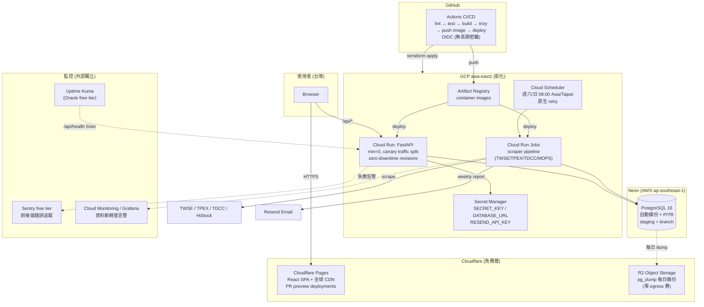

# 雲端架構與 DevOps 路線圖 + 學習地圖

> ⚠️ **閱讀前必看**:本文件是「雲端/DevOps 單軌視角」,工時假設(每週 6-10h)為單軌獨立估計;實際上三軌共用同一個時間池,執行時以 [`README.md`](./README.md) 的**整合時間表**與**跨軌決議(ADR)**為準。本文件中受 ADR 修訂的項目:
> - 排程系統演進簡化為兩步:Phase 1 printenv 止血 → host systemd timer 撐到上雲 → Cloud Run Jobs,刪除中間重寫(**ADR-2**)
> - Phase 1 的「手動 restore 演練成功」是**對外開放流量的 gate**,順序先於 DNS 切換(**ADR-10**)
> - Phase 3 DB 遷移 Neon 前:先實測 pg_database_size 並把 Neon Launch($19/月)納入成本情境;「月費 <$20」驗收改為含 DB 真實數字(**ADR-9**)
> - Phase 3 staging 從 prod 備份還原時必須匿名化 users 表(**補強-5**)
> - Phase 3 需加半天 spike:從 GCP asia-east1 實測四個資料源可爬,結果決定 Phase 4 pipeline 部署位置(**ADR-8**)
> - Phase 4 終態不含 Redis 常駐服務,與後端軌的 ARQ/WebSocket 衝突之處以 **ADR-1** 為準


> ⚠️ 2026-09 審查註記:實際上線平台已改為 **Oracle Ampere A1(ARM,2C/12G)** 而非 Hetzner;Phase 2 的 image build 需 `buildx --platform linux/arm64`,其餘差異見 [`05-review-2026-09.md`](./05-review-2026-09.md)。

> 前提假設:solo developer、每週 6–10 小時、目前狀態 = 本地 Docker Compose,`docker-compose.prod.yml` + Caddy 已寫好但尚未上線,**沒有 CI、沒有備份、沒有監控、沒有 Alembic migration**。這份路線圖的核心原則是:**先把單台 VPS 營運到「敢睡覺」的程度,再談雲端遷移**。過早跳到 AWS 只會同時學十件事然後全部半途而廢。

---

## 0. 三條路徑的具體比較(2026 年行情,USD/月)

| | (a) VPS | (b) PaaS | (c) Hyperscaler |
|---|---|---|---|
| **組合** | Hetzner CX22(2 vCPU/4GB)+ Caddy + Docker Compose;或 Oracle Cloud Free Tier(Ampere A1;**2026-06 起上限 2 OCPU/12GB**,aarch64/ARM) | Fly.io(API + scheduler machines)或 Railway/Render + **Neon** 或 Supabase Postgres + Cloudflare Pages(前端) | AWS:ECS Fargate + RDS + S3/CloudFront;GCP:**Cloud Run + Cloud SQL**(或 Cloud Run + Neon) |
| **月費估算** | Hetzner ~$4.5 + 官方 snapshot 備份 ~$1 + Storage Box(異地備份)~$4 ≈ **$6–10**;Oracle ≈ **$0**(但隨時可能被回收、台灣連線品質不穩) | Fly.io 2 台 shared-cpu-1x ~$4–8 + Neon Free(0.5GB,夠用一年)$0 或 Launch $19 + Cloudflare $0 ≈ **$5–30**;Railway Hobby ~$5+用量;Render Starter $7 + PG $7 ≈ $14+ | GCP:Cloud Run scale-to-zero ~$0–5 + Cloud SQL 最小實例 ~$10–15 + LB/egress ≈ **$15–35**;AWS:Fargate ~$9 + RDS t4g.micro ~$15 + **ALB ~$18** ≈ **$45–80**(NAT Gateway $32/月是新手最常踩的帳單地雷,務必避開) |
| **學到什麼** | Linux、systemd、網路、防火牆、備份還原 —— **SRE 基本功** | 12-factor app、health check、release 流程 —— 學得快但底層被抽象掉 | IAM、VPC、managed DB、IaC —— **FAANG 面試最有對話價值** |
| **維運負擔** | 全部自己扛(OS patch、磁碟、DB) | 幾乎為零 | 中等(IAM/網路設定複雜,但 DB/OS 免管) |
| **風險** | 單機 SPOF、你就是 on-call | vendor lock-in、免費層限制(Render free 會 spin down、Neon free 有 autosuspend) | 帳單失控、複雜度失控 |

**建議的分段路徑(本路線圖採用):**

```
Phase 1        Phase 2              Phase 3                    Phase 4
本地 Docker → Hetzner VPS 上線 → 同一台 VPS + 完整 CI/CD    → DB 先搬 Neon(managed PG)
              (現有 prod        + 備份演練 + 監控            → 再搬 compute 到 GCP Cloud Run
               compose 修好)     (把 VPS 營運到專業水準)       (或 Fly.io),VPS 降級為 staging
                                                              → Terraform 管全部
```

理由:資料量小(~1,900 檔股票、週更),VPS 完全夠用兩年;先搬 **DB**(狀態最難搬、風險最高、Neon 免費)再搬 **compute**(無狀態、隨時可搬回來),每一步都可逆。AWS/GCP 選 **GCP Cloud Run**:scale-to-zero 適合週更型流量、比 ECS Fargate + ALB 便宜 2–3 倍、部署模型(container → URL)與你現有 Docker 心智模型無縫接軌;AWS 留給證照學習(見學習地圖)。

---

## Phase 1(0–3 月):把現有 VPS 部署修到「能安全上線」

### 目標
`docker-compose.prod.yml` 真的部署到 Hetzner CX22 並對外服務,修掉目前 infra 層所有會直接造成事故的缺陷(root 容器、prod bind mount、無 migration、壞掉的 health check、dev compose 全網暴露)。

### 具體任務
- [ ] **修 Dockerfile**(~1 週):`backend/Dockerfile` 改成真正的 multi-stage(builder 裝 `build-essential` → runtime 只留 `libpq5`),加 `USER app`(non-root)、`HEALTHCHECK`;兩個 build context 各加 `.dockerignore`(排除 `logs/`、`.env`、`node_modules`);把第 1 行說謊的 "Multi-stage build" 註解改成事實
- [ ] **前端可重現 build**(~1 天):commit `package-lock.json`,`frontend/Dockerfile` 改 `COPY package*.json` + `npm ci`
- [ ] **導入 Alembic**(~1 週):`alembic init`,用 `--autogenerate` 從現有 models 產生 baseline migration;`deploy.sh` 在 `compose up` 前跑 `docker compose run --rm api alembic upgrade head`——這是 production 目前**唯一不存在的建表路徑**(`main.py:25-26` 在 prod 跳過 `init_db()`)
- [ ] **修 health check 斷鏈**(~半天):後端加 `GET /api/health`(或 Caddyfile 把 `/healthz` route 到 api),同步修 `scripts/deploy.sh:109`、`docs/deploy-to-vps.md:140`、`docs/部署到VPS.md:198`;compose 給 api/frontend/caddy 加 healthcheck
- [ ] **拿掉 prod bind mount**(~半天):刪 `docker-compose.prod.yml:47-49,63-65` 的 `./backend:/app`——prod 必須跑 image 而不是 host 原始碼;dev 用 `docker-compose.override.yml` 保留 bind mount
- [ ] **鎖住 dev compose**(~半天):`5432`/`8000` 改綁 `127.0.0.1:`,刪掉 `SECRET_KEY:-change-me-in-production` fallback(app 啟動時若無 SECRET_KEY 直接 crash);注意 **Docker 的 iptables 會繞過 UFW**,這是文件沒講的坑
- [ ] **修 scheduler cron 環境變數 bug**(~1 天):`cron_entry.sh` 的 cron job 拿不到 `DATABASE_URL`(Debian cron 不繼承 daemon env),最小修法是 entrypoint 先 `printenv | grep -E 'DATABASE_URL|RESEND|SECRET' > /etc/environment`;正解是 Phase 2 換掉 cron-in-container
- [ ] **上線**(~1 週):Hetzner CX22 + UFW + non-root user 照 `docs/deploy-to-vps.md` 走一遍,DNS → Caddy 拿到 Let's Encrypt 憑證,跑 `backfill_history.py`,清掉 `docs/oracle-cloud-automation.md` 裡的真實 Gmail 與 IP(已完成,見 `05-review-2026-09.md`)
- [ ] **最低限度備份**(~2 天):先不求完美——host crontab 每日 `pg_dump | gzip` 到 `/opt/backups`,保留 14 天,**手動做一次 restore 到本地驗證 dump 可用**

### 學習重點/資源
- **Docker 深化**:Nigel Poulton《Docker Deep Dive》(multi-stage、layer caching、non-root);官方 [Dockerfile best practices](https://docs.docker.com/build/building/best-practices/)
- **Linux 營運基本功**:`journalctl`、`systemd`、UFW、SSH hardening —— DigitalOcean community tutorials 品質最高
- **Alembic**:官方 tutorial 兩小時可完成,重點是理解 autogenerate 的極限(不會偵測 constraint 改名)

### 驗收標準
- `https://<domain>/api/health` 回 200,`docker compose ps` 全部 healthy
- `docker inspect` 顯示 api/scheduler 以 non-root 跑;backend image < 500MB(現在推估 ~1GB)
- 全新 VPS 上 `deploy.sh --init` 一鍵可重建整個系統(含 Alembic 建表),**不需要任何手動 SQL**
- 週六 08:00 的 cron pipeline 實際成功寫入 DB(檢查 `daily_quotes` 的 max(date))
- 你在本地成功從備份 dump 還原出完整資料庫一次

---

## Phase 2(3–6 月):CI/CD + 備份自動化 + 監控 —— 把 VPS 營運到專業水準

### 目標
從「SSH 上去 git pull」進化到「push to main → 自動測試 → 自動部署」;備份自動化 + 異地 + 演練;掛掉 5 分鐘內你會收到通知。

### 具體任務
- [ ] **GitHub Actions CI**(~2 週):`.github/workflows/ci.yml` — 四個 job:(1) backend:`ruff check` + `pytest`(配合後端組的測試建置,用 `services: postgres:16` 跑整合測試);(2) frontend:`eslint` + `tsc --noEmit` + `vitest`;(3) `docker build` 兩個 image 驗證可建;(4) `trivy` 掃 image 漏洞(會抓到 python-jose 的 CVE)
- [ ] **Container Registry**(~2 天):image push 到 **GHCR**(`ghcr.io/<you>/stockradar-api`,私有 repo 免費),tag 用 `sha-<short>` + `latest`;`docker-compose.prod.yml` 改成 `image:` 而非 `build:` —— 從此 **VPS 上不再 build,只 pull**(CX22 4GB 上 build pandas image 本來就很痛)
- [ ] **CD**(~1 週):`deploy.yml` — main 分支 CI 綠燈後,用 `appleboy/ssh-action` + deploy key SSH 到 VPS 跑 `docker compose pull && docker compose up -d && alembic upgrade head`;secrets 全放 GitHub Environments(`production`),開 required reviewers 當手動閘門
- [ ] **備份自動化 + 異地**(~1 週):host cron 每日 `pg_dump -Fc` → `rclone` 上傳 **Cloudflare R2**(10GB 免費、零 egress 費)或 Hetzner Storage Box;retention:日備份留 14 天、週備份留 8 週;**每季一次 restore 演練**寫成 `scripts/restore_drill.sh` 並記錄 RTO(目標 < 30 分鐘)。PITR(WAL archiving/`wal-g`)此階段先不做——週更資料 RPO=24h 可接受,概念留到 Phase 4 用 managed DB 免費獲得
- [ ] **監控三層**(~2 週):
  - **Uptime(外部)**:Uptime Kuma 跑在**另一台**免費機(Oracle free tier 或 Fly.io free)監控 `/api/health` + SSL 到期,Telegram/Discord 通知——監控不能跟被監控者同生共死
  - **錯誤追蹤**:Sentry free tier(5k events/月),FastAPI + React 各 10 行接入
  - **Metrics/Logs**:Grafana Cloud free tier(10k series + 50GB logs)+ VPS 上跑 Grafana Alloy 收 node metrics 與 Docker logs;告警:磁碟 >80%、pipeline 超過 8 天沒新資料(用 SQL exporter 查 `max(date)`——這是**業務級告警**,比 CPU 告警重要十倍)
- [ ] **Scheduler 去 cron 化**(~1 週):把 cron-in-container 換成 API 服務內的 APScheduler、或 host systemd timer 跑 `docker compose run --rm scheduler`;`run_scheduled.sh` 失敗要 exit non-zero 並打 Sentry/Telegram(修掉「失敗 3 次照樣寄報告、永遠 exit 0」的問題)
- [ ] **Log 治理**(~2 天):兩個 compose 加 `logging: {driver: json-file, options: {max-size: 10m, max-file: "3"}}`;`./logs` 加 logrotate

### 學習重點/資源
- **GitHub Actions**:官方 docs +([GitHub Skills](https://skills.github.com/) 免費互動課);重點概念:reusable workflows、environments、OIDC(Phase 4 對 AWS/GCP 免密鑰認證會用到)
- **SRE 入門**:Google《[Site Reliability Engineering](https://sre.google/sre-book/table-of-contents/)》免費線上版,精讀 ch.4 SLOs、ch.6 Monitoring —— 「symptom-based alerting」直接對應你的「pipeline 資料過期告警」
- **Prometheus/Grafana**:Grafana Cloud 官方 onboarding 教學夠用,不用買課
- **面試對應**:CI/CD pipeline 設計、SLO/error budget、「你怎麼知道系統掛了」是 FAANG SRE/infra 面試必考題,這一階段全是實戰素材

### 驗收標準
- push to main → 15 分鐘內新版本自動上線,期間 `/api/health` 不中斷(compose 的 `up -d` 配 healthcheck 已足夠,真 zero-downtime 留 Phase 4)
- 手動 `docker stop stockradar-api` → 5 分鐘內收到 Telegram 告警
- R2 上可看到 14 天的每日 dump;restore 演練文件記錄了實測 RTO
- CI 上任何 PR 都有 lint + test + build + trivy 四道閘門;VPS 上 `docker compose config` 已看不到任何 `build:`
- 連續 4 個週末 pipeline 自動成功(或失敗有告警),你零手動介入

---

## Phase 3(6–12 月):Staging、Terraform、DB 上雲

### 目標
建立 staging 環境與 IaC 心智;把最難搬的東西(PostgreSQL)遷到 managed 服務,完成第一次真實的資料庫遷移演練。

### 具體任務
- [ ] **Staging 環境**(~2 週):最省錢做法——同一台 VPS 跑第二組 compose project(`stockradar-staging`,Caddy 加 `staging.<domain>` site block),或 Oracle free tier 當 staging 機;CD 改成 main → staging 自動部署、production 需手動 approve(GitHub Environments);staging DB 每週從 prod 備份還原(**順便就是 restore 演練自動化**)
- [ ] **Terraform 起步**(~1 個月,學習曲線在此):用 Terraform 管理現有資源而非新建—— (1) Hetzner provider:server、firewall、snapshot policy;(2) Cloudflare provider:DNS records、R2 bucket;(3) GitHub provider:repo settings、branch protection、Actions secrets。State 放 Terraform Cloud free tier 或 R2 backend。驗收心法:**砍掉 DNS record 再 `terraform apply` 能長回來**
- [ ] **DB 遷移到 Neon**(~1 個月):
  - 開 Neon 專案(區域選 AWS ap-southeast-1 新加坡,台灣延遲 ~50ms,對你的查詢型態無感)
  - `pg_dump -Fc` → `pg_restore` 到 Neon,寫 `scripts/migrate_db.sh` 含資料量核對(每張表 row count + max(date) 比對)
  - 切換 = 改 `DATABASE_URL` + redeploy;**保留 VPS postgres 兩週雙軌**(pipeline 同時寫兩邊或保留舊庫唯讀)以便一鍵回退
  - 遷移後拿到免費的:自動備份 + **PITR**(Neon 免費層 24h restore window)、branch 功能(staging DB 直接 branch from prod,取代 dump/restore)
- [ ] **前端搬 Cloudflare Pages**(~1 週):Vite build 是純靜態檔,搬到 Pages 得到免費全球 CDN + preview deployments(每個 PR 一個 URL);Caddy 只剩 `/api/*`;`VITE_API_BASE` 指向 API domain,CORS origins 對應調整
- [ ] **秘密管理升級**(~1 週):VPS 上的 `.env` 改由 **SOPS + age** 加密後進 git(或 Doppler free tier),部署時解密——消除「secrets 只存在於 VPS 一份、機器掛了 secrets 也沒了」的風險
- [ ] **壓測與容量認知**(~1 週):`k6` 對 `/api/screen` 打 100 併發,記下 p95;這會逼出後端組的 pagination/index 問題,也是 Phase 4 選 Cloud Run 資源規格的依據

### 學習重點/資源
- **Terraform**:Yevgeniy Brikman《Terraform: Up & Running》第 3 版(讀前 5 章即可動手)+ [HashiCorp Developer tutorials](https://developer.hashicorp.com/terraform/tutorials);重點:state 的本質、`plan` 的閱讀、module 化、workspace vs 多目錄
- **資料庫維運**:Neon docs 的 branching/PITR 概念;順讀《Designing Data-Intensive Applications》(DDIA)ch.1–3、ch.5(replication)——**FAANG system design 面試的聖經**,你剛做完的 DB 遷移就是活教材
- **面試對應**:「如何零停機遷移資料庫」「staging 與 prod 的資料同步策略」是 senior 面試常見題,你將有第一手答案

### 驗收標準
- `terraform plan` 對現有全部 DNS/firewall/R2 資源顯示 no changes(現實已收斂進 IaC)
- Prod 跑在 Neon 上連續 4 週無異常;VPS 上的 postgres 容器已下線
- PR 開出來自動有 staging 前端 preview URL;staging DB 是 Neon branch,一鍵重建
- 你能在 30 分鐘內用 PITR 把 DB 還原到任意過去 24h 內的時間點(實際演練過)
- 記錄在案的 `/api/screen` p95 延遲基準(遷移前 vs 遷移後)

---

## Phase 4(12–24 月):Compute 上雲(Cloud Run)、零停機、成本治理

### 目標
完成 cloud-native 遷移:無狀態 compute 跑在 GCP Cloud Run,全部基礎設施進 Terraform,zero-downtime deploy 成為預設,月成本有預算與告警。VPS 退役或降級為實驗機。

### 具體任務
- [ ] **API 遷移到 Cloud Run**(~1.5 個月):
  - GCP 專案 + Artifact Registry(取代/並存 GHCR),region `asia-east1`(彰化!台灣本地 region,延遲個位數 ms)
  - GitHub Actions 用 **Workload Identity Federation(OIDC)** 對 GCP 認證——零長期密鑰,這是現代 CD 的標準做法,面試加分項
  - Cloud Run service:min-instances=0(週更流量,scale-to-zero 月費趨近 $0)、`--cpu=1 --memory=512Mi`、secrets 掛 **Secret Manager**;DB 連 Neon(不搬 Cloud SQL,省 $10–15/月且已有 PITR)
  - Cloud Run **revision + traffic splitting** 原生提供 zero-downtime + canary(10% 新版本觀察 Sentry 再 100%)——這就是你的 blue-green
- [ ] **Scheduler 遷移**(~2 週):**Cloud Run Jobs + Cloud Scheduler**(cron 表達式觸發 job)取代 scheduler 容器——徹底終結 cron-in-container 的所有問題(env 注入、失敗可見性、retry 原生支援、機器重開錯過排程);pipeline 單次跑 30–60 分鐘,設 `--task-timeout=3600`
- [ ] **全套 Terraform 化**(~1 個月):google provider module:Cloud Run services/jobs、Scheduler、Secret Manager、Artifact Registry、IAM(最小權限 service accounts);CI 加 `terraform plan` on PR + `apply` on merge(Atlantis 模式的簡化版)
- [ ] **監控收斂**(~2 週):Cloud Run 原生日誌/metrics 進 Cloud Monitoring;保留 Sentry + Uptime Kuma;告警規則移植:5xx rate、job 失敗、**資料新鮮度**
- [ ] **成本治理**(~1 週):GCP Budget $30/月 + 50%/90%/100% email 告警;Billing export to BigQuery 看每服務成本;檢查表:無 idle Cloud SQL、無 min-instances>0 的閒置服務、Artifact Registry 加 cleanup policy(只留最近 10 個 image)
- [ ] **VPS 退役決策**(~1 週):全量流量切到 Cloud Run 一個月後,Hetzner 降級為個人實驗機或退租;寫一篇遷移復盤(成本前後對比、延遲對比、事故記錄)——**這篇文件就是你的面試作品集**
- [ ] **(選修)Kubernetes 認知**:不建議把這個專案搬上 K8s(規模不配),但可以用 `kind` 在本地把 stack 部署成 K8s manifests 練手,理解 Deployment/Service/Ingress 與 Cloud Run 抽象的對應關係——面試講得出「為什麼我沒用 K8s」比用了更加分

### 學習重點/資源
- **GCP**:[Google Cloud Skills Boost](https://www.cloudskillsboost.google/) 的 Cloud Run learning path;官方 docs 的 Cloud Run jobs + Scheduler 教學
- **AWS 對照學習(證照)**:若目標是求職,考 **AWS Solutions Architect Associate(SAA-C03)**——Adrian Cantrill 的課(cantrill.io,深度最佳)或 Stephane Maarek(Udemy,速度最佳)。AWS 市占仍最大,「GCP 實戰 + AWS 證照」是 solo dev 性價比最高的組合;GCP ACE 證照可選,面試價值低於實戰經驗
- **System Design**:Alex Xu《System Design Interview》vol.1–2;把你的架構套進去講:CDN(Cloudflare)→ stateless compute(Cloud Run)→ managed DB(Neon)→ async pipeline(Cloud Run Jobs)→ 監控/告警——**這就是一套完整的 system design 面試答案,而且每個環節你都真的營運過**

### 驗收標準
- Deploy 全程 zero-downtime:CD 期間以 k6 持續打 `/api/screen`,錯誤率 0%
- `terraform destroy` + `apply` 能在新 GCP 專案重建全部基礎設施(DB 資料除外);repo 裡沒有任何點擊 console 產生而未入 IaC 的資源
- GCP 月帳單 < $20(含 Artifact Registry 與 egress),且有 budget 告警實測觸發過一次
- 週末 pipeline 由 Cloud Scheduler 觸發、失敗自動 retry、失敗兩次後你收到告警——連續 8 週無手動介入
- 你能對著架構圖完整講 45 分鐘:每個元件為什麼選它、錢花在哪、掛掉會怎樣、怎麼知道掛掉

---

## 目標雲端架構圖(Phase 4 終態)



---

## 學習地圖:順序、資源、面試價值

> 原則:**每項技能都掛在專案的一個真實 milestone 上學**,不獨立刷課。順序即依賴順序。

| 順序 | 技能 | 學習時機 | 具體資源 | 投入 | FAANG 面試價值 |
|---|---|---|---|---|---|
| 1 | **Docker 深化**<br/>(multi-stage、non-root、layer cache、compose 網路) | Phase 1,修 Dockerfile 時 | Nigel Poulton《Docker Deep Dive》;官方 best practices docs | 2–3 週 | ★★★☆☆ 基本盤,不會是扣分項而非加分項;但「為什麼 non-root」「iptables 繞過 UFW」這類細節能展現深度 |
| 2 | **Linux/網路營運**<br/>(systemd、UFW、DNS、TLS) | Phase 1,VPS 上線時 | DigitalOcean tutorials;Julia Evans 的 zines(《Networking! ACK!》) | 持續 | ★★★★☆ SRE/infra 面向必備;troubleshooting 題(「curl 通但瀏覽器不通,查什麼?」)的底氣來源 |
| 3 | **GitHub Actions / CI-CD** | Phase 2 | GitHub Skills(免費);官方 docs 的 OIDC + environments 章節 | 2–3 週 | ★★★★☆ 「描述你的 deploy pipeline」是 behavioral+system 混合必考;OIDC 無密鑰部署是差異化亮點 |
| 4 | **可觀測性 / SRE 實務**<br/>(SLO、alerting、incident) | Phase 2 | Google SRE Book(免費,精讀 ch.4/6);Grafana Cloud 教學 | 3–4 週 | ★★★★★ 「你怎麼知道系統健康」「講一次事故」——你會有真實 pipeline 失敗與告警的故事,比背書的人強一個級距 |
| 5 | **PostgreSQL 營運**<br/>(backup/restore、PITR、遷移) | Phase 2–3 | Neon docs;《The Art of PostgreSQL》選讀;DDIA ch.5 | 3–4 週 | ★★★★★ 資料庫遷移經驗在 system design 面試極稀缺;「RPO/RTO 怎麼定」你有實測數字 |
| 6 | **Terraform / IaC** | Phase 3 | 《Terraform: Up & Running》3rd ed(前 5 章);HashiCorp tutorials | 1–1.5 月 | ★★★★☆ infra/platform 職缺硬需求;重點是能講 state、drift、plan review 流程,不是背 HCL 語法 |
| 7 | **GCP Cloud Run 實戰** | Phase 4 | Cloud Skills Boost serverless path;官方 Cloud Run docs | 1–1.5 月 | ★★★★☆ serverless container 是當前主流架構;traffic splitting/canary 是 deploy 策略考題的實戰答案 |
| 8 | **AWS SAA-C03 證照** | Phase 4 並行(可選) | Adrian Cantrill(深)或 Stephane Maarek(快)+ Tutorials Dojo 模擬題 | 2–3 月 | ★★★☆☆ 證照本身 FAANG 不看,但 SAA 的知識面(VPC/IAM/RDS/多 AZ)恰好是 system design 詞彙表;台灣就業市場則明確加分 |
| 9 | **System Design 總整理** | Phase 4 後 | Alex Xu vol.1–2;DDIA 全書;把自己的架構寫成一篇 design doc | 持續 | ★★★★★ 終極整合:你的專案 = 一套可深問三層的 system design 案例(CDN→stateless→managed DB→async jobs→observability→cost) |
| — | **Kubernetes**(認知即可) | Phase 4 選修 | 官方 tutorial + `kind` 本地練習 | 2 週 | ★★★☆☆ 面試講「評估過但規模不配,選了 Cloud Run,trade-off 是……」比硬上 K8s 更顯 senior |

**兩年後你的履歷敘事**:「獨立將一個真實用戶使用的金融資料產品,從本地 Docker 演進到單 VPS 生產環境(含 CI/CD、自動備份與還原演練、SLO 告警),再零停機遷移至 serverless 雲架構(Cloud Run + Neon + Terraform 全 IaC),月成本 < $20,連續 N 個月無人工介入自動營運。」——這一段話的每個子句都對應本路線圖的一個驗收標準,且每一項你都能被追問三層而不虛。